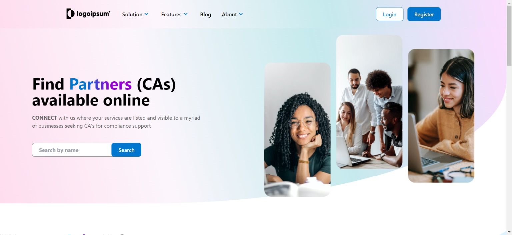

# Logoipsum



Logoipsum is a personal project where I've created a dynamic landing page app using Vite, React, and Tailwind CSS. The app utilizes a fake API built with JSON Server, with endpoints available at https://fake-api-v2ck.onrender.com/CADetails. This API serves data for CA (Chartered Accountant) details, and I've implemented a dedicated page for CA details using React Router DOM.

## Features

- **Fake API Integration**: Utilizes a fake API built with JSON Server to simulate real API calls.
- **CA Detail Page**: Implements a detailed page for Chartered Accountant information fetched from the API.
- **React Router DOM**: Navigates between different pages seamlessly using React Router DOM.
- **Dependencies**: Utilizes various libraries including Tailwind CSS, Axios, React Hot Toast, React Spinners, and React Router DOM.

## Project Setup

### Prerequisites

Make sure you have Node.js and npm (or Yarn) installed on your system.

### Installation

1. Clone the repository:

   ```bash
   git clone (https://github.com/KamalJoshi-web/Logoipsum.git)
   cd logoipsum
   ```

2. Install dependencies using npm:

   ```bash
   npm install
   ```

3. Start the development server:
   ```bash
   npm run dev
   ```

## Fake API

The app uses a fake API to simulate real API calls. The API endpoints are available at:

- **CA Details Endpoint**: `https://fake-api-v2ck.onrender.com/CADetails`

## Dependencies

- **Tailwind CSS**: A utility-first CSS framework for designing responsive and customizable UI components.
- **Axios**: A popular HTTP client for making asynchronous requests to the API endpoints.
- **React Hot Toast**: A toast notification library for React applications, providing customizable and responsive notifications.
- **React Spinners**: A collection of loading spinner components for React applications.
- **React Router DOM**: A declarative routing library for React applications, enabling navigation between different pages.

## Usage

1. Access the landing page by opening `http://localhost:3000` in your web browser.
2. Navigate to the CA detail page by clicking on relevant links or buttons within the app.

Feel free to explore the codebase, modify the components, and customize the app according to your preferences.

## Contributions

Contributions are welcome! If you find any issues or have suggestions for improvements, please create an issue or submit a pull request.
